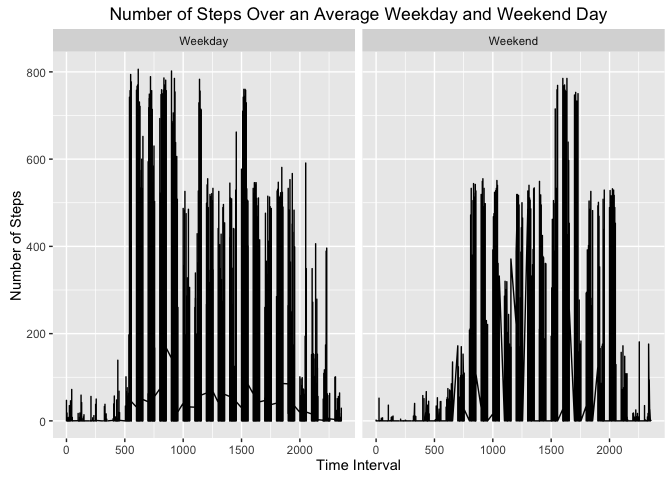

# Reproducible Research: Peer Assessment 1


## Loading and preprocessing the data


```r
setwd("/Users/harshitha.ramesh/Documents/RepData_PeerAssessment1/")
data <- read.csv("activity.csv")
```

## What is mean total number of steps taken per day?

```r
library(plyr)
sum_days <- ddply(data,.(date),summarise,sum=sum(steps))
hist(sum_days$sum,xlab="Steps per Day",ylab = "Number of Days", main = "Histogram of Total Steps per Day")
```

<!-- -->

```r
mean_days <- mean(sum_days$sum,na.rm = TRUE)
median_days <- median(sum_days$sum,na.rm = TRUE)
print(paste("Mean = ",as.character(mean_days)," steps"))
```

```
## [1] "Mean =  10766.1886792453  steps"
```

```r
print(paste("Median = ",as.character(median_days)," steps"))
```

```
## [1] "Median =  10765  steps"
```
The mean for the total number of steps is 10766.19 steps while the median is 10765 steps.

## What is the average daily activity pattern?

```r
mean_intervals <- ddply(data,.(interval),summarise,mean=mean(steps,na.rm = TRUE))
with(mean_intervals,plot(interval,mean,type = "l", xlab = "Interval", ylab = "Number of Steps", main = "Average Steps per Time Interval in a Day"))
```

<!-- -->

```r
max_interval <- mean_intervals[mean_intervals$mean == max(mean_intervals$mean),"interval"]
print(paste("5-Minute Interval with Maximum Amount of Steps = ",as.character(max_interval)))
```

```
## [1] "5-Minute Interval with Maximum Amount of Steps =  835"
```
The 5 minute interval with the maximum amount of steps is 835.


## Imputing missing values

```r
library(Hmisc)
num_missing_rows <- nrow(data) - sum(complete.cases(data))
print(paste("Number of Incomplete Cases = ",as.character(num_missing_rows),"rows"))
```

```
## [1] "Number of Incomplete Cases =  2304 rows"
```

```r
new_data <- ddply(data,"interval",mutate,imputed.value = impute(steps,mean))
new_sum_days <- ddply(new_data,.(date),summarise,sum=sum(imputed.value))
hist(new_sum_days$sum,xlab="Steps per Day",ylab = "Number of Days", main = "Histogram of Total Steps per Day")
```

<!-- -->

```r
new_mean_days <- mean(new_sum_days$sum,na.rm = TRUE)
new_median_days <- median(new_sum_days$sum,na.rm = TRUE)
print(paste("Mean = ",as.character(new_mean_days)," steps"))
```

```
## [1] "Mean =  10766.1886792453  steps"
```

```r
print(paste("Median = ",as.character(new_median_days)," steps"))
```

```
## [1] "Median =  10766.1886792453  steps"
```
With imputed values for missing values in the data, the mean for the total number of steps is 10766.19 steps while the median is 10765 steps.These new estimates differ very little from the estimates from the first part of the assignment. the impact of imputing missing data on the estimates is that both the median skewed more closely to the precise value of the mean, since there are more data points with value of the mean. 


## Are there differences in activity patterns between weekdays and weekends?

```r
library(ggplot2)
new_data$day <- factor(weekdays(as.Date(new_data$date)) %in% c("Monday","Tuesday","Wednesday","Thursday","Friday"), levels = c("TRUE","FALSE"),labels = c("Weekday","Weekend"))
ggplot(new_data,aes(interval,imputed.value)) + facet_grid(.~day) + geom_line() + xlab("Time Interval") + ylab("Number of Steps") + ggtitle("Number of Steps Over an Average Weekday and Weekend Day")
```

```
## Don't know how to automatically pick scale for object of type impute. Defaulting to continuous
```

<!-- -->


On a weekday, there is much more actvity,especially in the earlier part of the day and similar amounts of activity in the latter part of the day as a weekend day. On a weekend day, there is a spike of activity in the evening, but generally low levels of activity throughout the day.
